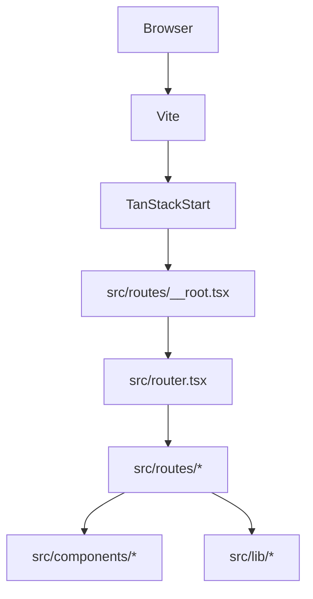

# FamilIA Technical Stack and Architecture

## Overview

FamilIA is a single-page style web application built with TanStack Start on top of Vite. It uses file-based routing, a shared root shell, and a component-driven UI to present a public landing site plus a tutor-facing dashboard experience.

The codebase is intentionally split into three layers:

- Routing and application shell in `src/routes`, `src/router.tsx`, and `src/start.ts`
- Shared UI and feature components in `src/components`
- Mock data, storage helpers, and utility functions in `src/lib`

## Stack Breakdown

### Runtime and Framework

- React 19 for UI rendering.
- TanStack Start for the app framework and server entry integration.
- TanStack Router for file-based routing and route-level metadata.
- TanStack Query for data context provisioning at the root.
- Vite as the development server and production bundler.
- TypeScript for static typing.

### Styling and Presentation

- Tailwind CSS 4 for utility-first styling.
- `@tailwindcss/vite` for Vite integration.
- `tailwind-merge` and `clsx` for composing classes safely.
- `class-variance-authority` for component variants.
- `tw-animate-css` for animation utilities.
- Framer Motion for motion on landing and dashboard surfaces.

### UI Component Library

- Radix UI primitives for accessible interactive controls.
- Lucide React icons for most interface icons.
- `react-icons` for LinkedIn-style branding icons where needed.
- Custom components in `src/components/ui` wrap reusable primitives like cards, buttons, inputs, tabs, and navigation shells.

### Forms, Validation, and Inputs

- `react-hook-form` for form handling.
- `@hookform/resolvers` and Zod for schema-backed validation.
- `input-otp` for the 4-digit PIN entry UI.
- `react-phone-number-input` for phone inputs.

### Data Visualization and Interaction

- Recharts for the finance chart.
- Embla Carousel for carousel-style content patterns.
- `react-resizable-panels` for resizable layout primitives.
- `sonner` for toast notifications.
- `react-day-picker`, `cmdk`, and `vaul` are present for date picking, command palette, and drawer interactions.

### Data and Content Model

- `src/lib/dashboard-mocks.ts` supplies the dashboard sample data.
- `src/lib/elder-profile.ts` stores and retrieves elder profile data from browser `localStorage`.
- `src/lib/utils.ts` provides common helpers such as `cn`.
- `src/lib/error-page.ts` renders fallback error markup on the server.

## Application Architecture

### Request Flow

### Bootstrapping

1. `src/start.ts` creates the TanStack Start instance.
2. Server middleware wraps requests and renders a fallback HTML error page on unexpected failures.
3. `src/router.tsx` creates the router with a `QueryClient` context.
4. `src/routes/__root.tsx` installs the root HTML shell, global stylesheet, query provider, and nested route outlet.

### Routing Model

The app uses file-based routing. Important route groups:

- `/` landing page
- `/pricing` pricing page
- `/auth/signin` and `/auth/signup` entry points
- `/dashboard` dashboard shell
- `/dashboard/activity` activity audit view
- `/dashboard/finance` finance summary and anomaly view
- `/dashboard/settings` profile and subscription settings

`src/routes/routeTree.gen.ts` is generated from the route files and should not be edited manually.

### Data Flow

The app is mostly local-state driven, but the copilot flow reaches a remote endpoint to obtain assistant responses:

- Landing and pricing pages are static or semi-static.
- Dashboard pages read from mock arrays and derived values in `src/lib/dashboard-mocks.ts`.
- Elder profile settings are persisted to browser `localStorage`.
- The copilot route packages text, audio, and image inputs into `FormData`, posts them to a remote webhook endpoint, and renders the returned assistant response.
- Route transitions are handled entirely on the client with TanStack Router links and navigation hooks.

## Key Decisions

### TanStack Start over a traditional SPA

TanStack Start provides file-based routing, SSR-friendly boundaries, and a coherent server/client split without introducing a larger meta-framework.

### Mock data for dashboard screens

The dashboard uses deterministic data to keep the UI stable and easy to review. This is separate from the copilot route, which performs a live request to a remote service to get assistant output.

### Shared root shell and route-level metadata

Route-level `head()` definitions keep titles and descriptions close to the pages that own them, while the root route centralizes the document shell and shared providers.

### Local storage for elder profile state

The elder profile settings store name, phone, and PIN values in browser storage. That keeps the settings flow working without backend dependencies while the assistant endpoint handles the conversational responses.

## Operational Notes

- Use Bun for dependency installation when possible because the repository has a Bun lockfile.
- `bun run lint` currently reflects the repository-wide ESLint and Prettier rules.
- `bun run build` is the best quick check for routing and TypeScript integration.

## File Map

- `src/start.ts` server bootstrap and request middleware
- `src/router.tsx` router creation
- `src/routes/__root.tsx` app shell and providers
- `src/routes/index.tsx` marketing landing page
- `src/routes/pricing.tsx` pricing entry point
- `src/routes/auth/*` signup and signin flows
- `src/routes/dashboard*` tutor dashboard pages
- `src/components/ui/*` reusable UI primitives
- `src/components/dashboard/*` dashboard-specific widgets
- `src/lib/*` mock data, profiles, utilities, and error handling
