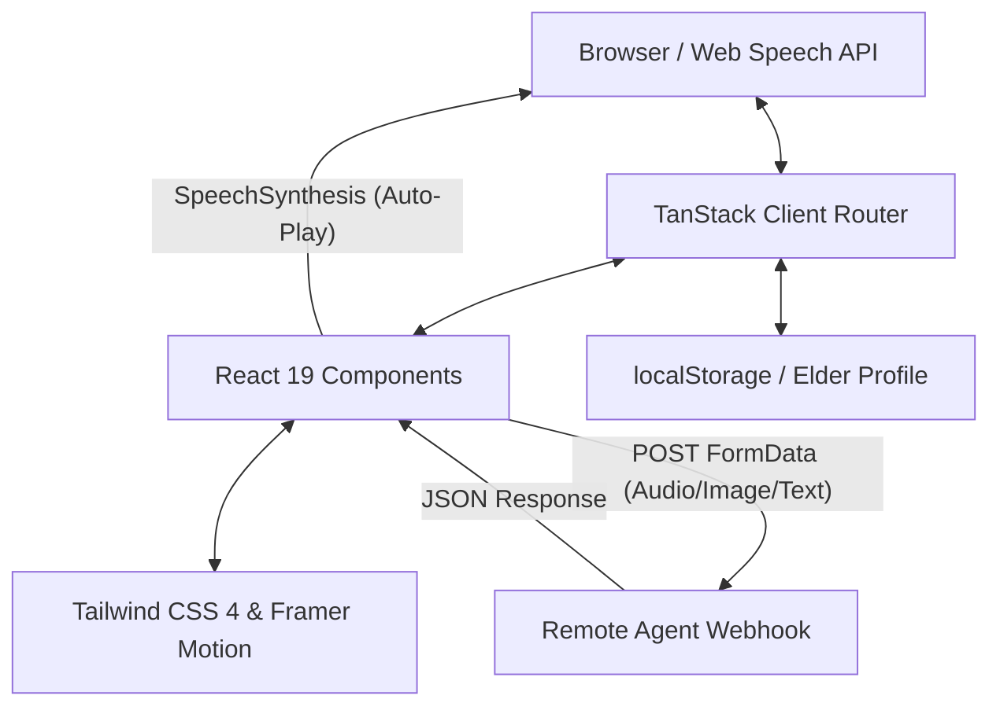
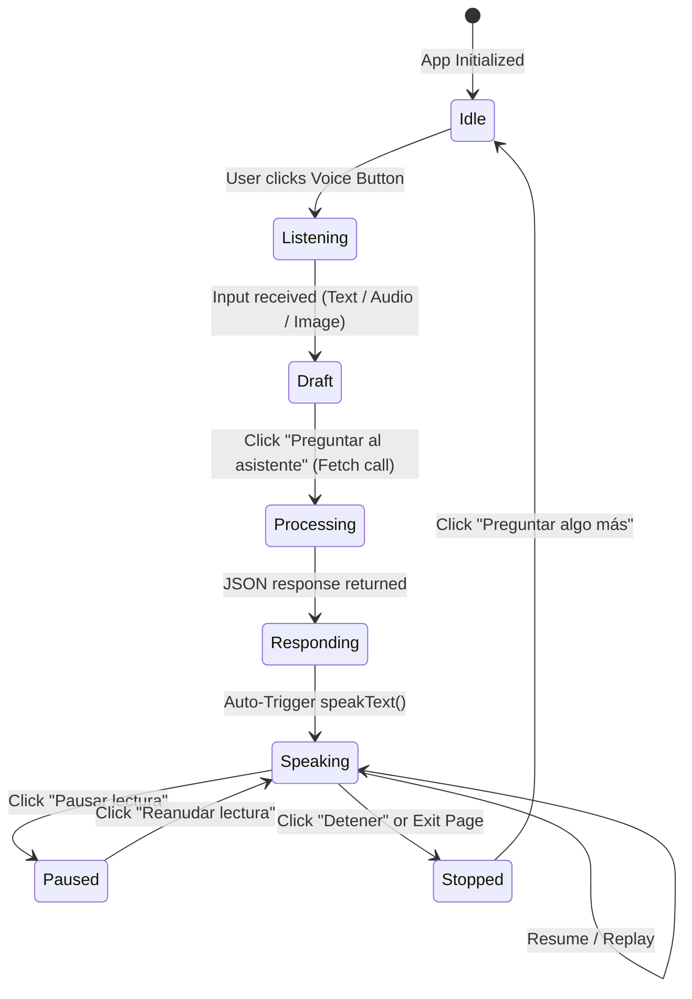

# 🛠️ FamilIA Technical Stack and Architecture

This document provides a comprehensive technical reference for the architecture, dependencies, state management, and custom integrations of the FamilIA application.

---

## 🏛️ System Architecture

FamilIA is structured as a modern, server-side rendered (SSR) web application utilizing **TanStack Start** on top of **Vite**. The client-side layers interact with server hooks, local browser states, and external REST API webhooks.



### Key Framework Blocks

1. **Framework Engine:** [TanStack Start](https://tanstack.com/start) wraps React 19, enabling seamless hydration, route loading, and server middleware injection.
2. **Routing Layer:** [TanStack Router](https://tanstack.com/router) drives type-safe, file-based routes mapped dynamically under `src/routes/*`.
3. **Caching & Fetching:** [TanStack Query](https://tanstack.com/query) sets up context providers at the root route to manage asynchronous server-state queries.
4. **Style Layer:** [Tailwind CSS 4](https://tailwindcss.com) utilizing CSS-native variables, paired with [Framer Motion](https://www.framer.com/motion/) for smooth micro-animations.

---

## 📂 Codebase File Mapping

```text
src/
├── start.ts            # Server entry point and global middleware bootstrap
├── router.tsx          # Client router bootstrap, linking QueryClient contexts
├── routes/             # Route configurations
│   ├── __root.tsx      # Main application HTML shell, query providers, & stylesheets
│   ├── index.tsx       # Landing page route
│   ├── pricing.tsx     # Pricing comparisons
│   ├── auth/           # Entry views for Tutors and Elders
│   ├── dashboard.tsx   # Base shell layout for the Tutor dashboard
│   ├── dashboard/      # Sub-views (index.tsx, activity.tsx, finance.tsx, settings.tsx)
│   └── copilot.tsx     # Senior Copilot page (handling input forms & TTS engine)
├── components/         # Reusable UI primitives
│   ├── ui/             # General-purpose layout components (OTP input, voice input, carousels)
│   └── dashboard/      # Dashboard cards (overview charts, timelines, anomaly alerts)
└── lib/                # Utilities and storage managers
    ├── elder-profile.ts # localStorage accessors for custom user settings
    ├── dashboard-mocks.ts # Mock datasets for finance logs and activity timelines
    └── utils.ts        # Helper files (class-name joiners)
```

---

## 🎙️ Deep Dive: Text-to-Speech (TTS) Integration

The **Text-to-Speech (TTS)** engine is embedded into the Copilot route (`src/routes/copilot.tsx`). It provides automated, accessible feedback for seniors by translating written AI responses into speech.

### 🔄 The Speech Lifecycle & State Machine



---

### 💻 Code Implementation Details

The voice assistant leverages the native browser [Web Speech API](https://developer.mozilla.org/en-US/docs/Web/API/Web_Speech_API) via the following implementations:

#### 1. Regex Markdown Sanitization

Before feeding text to the Speech Synthesis engine, it must be cleaned. Otherwise, the engine reads aloud control characters (e.g., _"asterisk asterisk Importante asterisk asterisk"_).

```typescript
// Removes markdown symbols (*, _, #, `, ~, >) and formats hyperlinks to speak the link text
const cleanText = text.replace(/[*_#`~>]/g, "").replace(/\[([^\]]+)\]\([^)]+\)/g, "$1");
```

#### 2. Localized Voice Selection

The TTS script targets Spanish (`es-ES`) and handles asynchronous browser initialization safely (a common quirk in Chromium engines):

```typescript
const utterance = new SpeechSynthesisUtterance(cleanText);
utterance.lang = "es-ES";

const selectVoice = () => {
  const voices = window.speechSynthesis.getVoices();
  const esVoice = voices.find((v) => v.lang.startsWith("es"));
  if (esVoice) {
    utterance.voice = esVoice;
  }
};

selectVoice();
if (window.speechSynthesis.onvoiceschanged !== undefined) {
  window.speechSynthesis.onvoiceschanged = selectVoice;
}
```

#### 3. Automatic Playback Trigger

A React `useEffect` hook monitors the copilot mode. When the assistant transitions to `responding` and the payload response contains text, the speech engine is triggered automatically. When switching away, the speech is immediately cancelled to prevent overlapping audio:

```typescript
useEffect(() => {
  if (mode === "responding" && response) {
    speakText(response);
  } else {
    stopSpeech();
  }
  return () => {
    stopSpeech();
  };
}, [mode, response, speakText, stopSpeech]);
```

#### 4. Control Interface State Binding

The UI binds playback state to interactive buttons, allowing users to toggle speech states gracefully:

- **`window.speechSynthesis.speak(utterance)`**: Initiates audio playback.
- **`window.speechSynthesis.pause()`**: Temporarily pauses.
- **`window.speechSynthesis.resume()`**: Continues narration from where it stopped.
- **`window.speechSynthesis.cancel()`**: Fully halts execution and flushes the speech queue.

---

## 🏛️ Architectural Decisions & Trade-offs

### 1. TanStack Start for Hydration & Speed

- **Decision:** Choosing TanStack Start over traditional Client-Only Single Page Applications (SPAs).
- **Trade-off:** Introduces SSR complexity (such as ensuring code blocks like `window.speechSynthesis` check for `typeof window === "undefined"` to prevent node compiler failures), but yields superior initial page load speeds and SEO indexing potential.

### 2. Browser Local Storage for Simulated State

- **Decision:** Utilizing `localStorage` to manage parameters like the elder's customized name or cash baseline inside [elder-profile.ts](file:///home/vinomo/programming/master/data_science_and_ai/familia-b3b8cda0/src/lib/elder-profile.ts).
- **Trade-off:** Avoids complex database connections during development, keeping the app self-contained, but state cannot be shared across different browsers or cleared devices.

### 3. Asynchronous Remote API Webhook

- **Decision:** Routing the Copilot payload to an external agent endpoint (`https://209.38.213.186.sslip.io/webhook/...`).
- **Trade-off:** The frontend parses multimodal uploads (text, voice audio, image attachments) into a `FormData` envelope. The API parses various structured keys (e.g. `user_defense_guidance`, `easy_explanation`, `elderly_guidance_es`) to return context-rich answers tailored for the elder.
