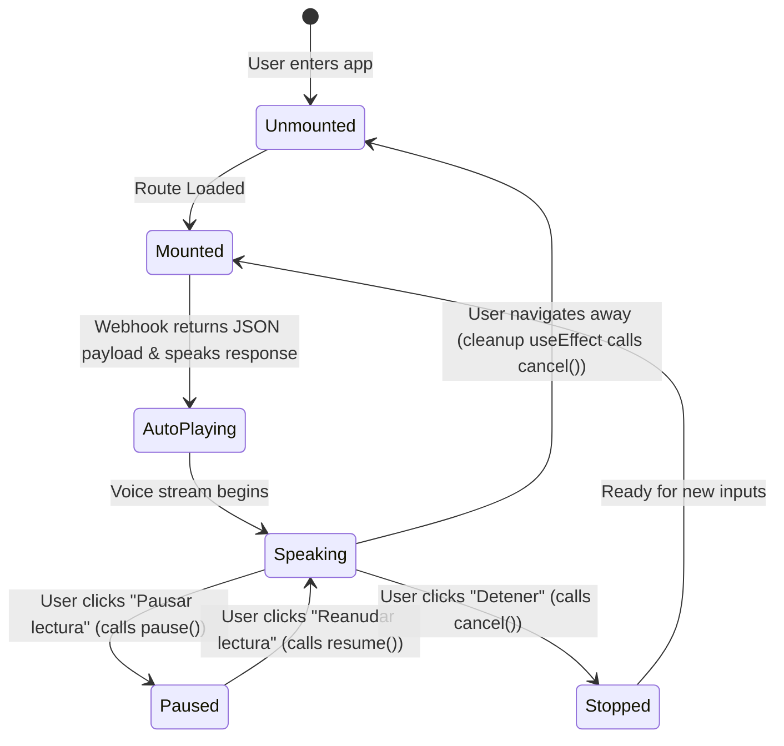
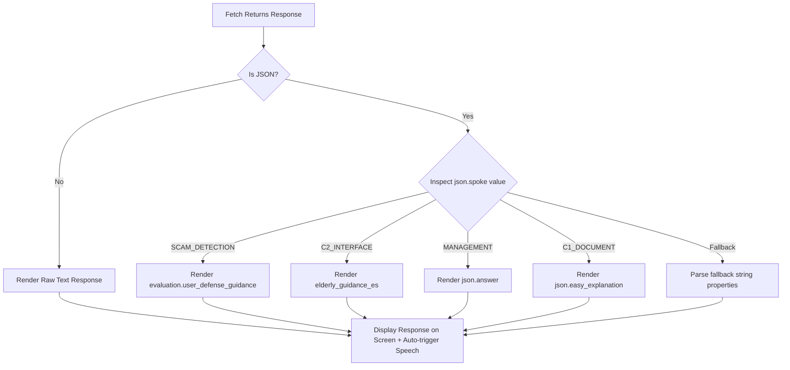

# 🛠️ FamilIA Deep Technical Stack and Architecture

This document provides a detailed technical reference of the architecture, modules, algorithms, state configurations, and dependency trees that compose the FamilIA web application.

---

## 🏛️ 1. Technical Framework & Core Stack

FamilIA is a server-side rendered (SSR) web application utilizing **React 19** and **TypeScript**, packaged and served via the **TanStack Start** meta-framework.

```
+-------------------------------------------------------------+
|                     Client Browser Layer                    |
|  - React 19 UI Components (Tailwind CSS 4, Framer Motion)   |
|  - Web Speech API (SpeechSynthesisUtterance)                |
|  - Local Storage State Managers                             |
+-------------------------------------------------------------+
                              |
                     SSR Hydration Request
                              v
+-------------------------------------------------------------+
|                 TanStack Start Server Engine                |
|  - Server-Bootstrap Middleware (src/start.ts)               |
|  - File-Based Routing Compiler (src/routes/*)               |
|  - SSR Hydration Boundaries & HTML Injectors                |
+-------------------------------------------------------------+
                              |
                      REST Webhook Calls
                              v
+-------------------------------------------------------------+
|               Remote Multimodal LLM Endpoint                |
|  - Processes JSON & Form-Data payloads                      |
|  - Returns classified agent evaluations & guides            |
+-------------------------------------------------------------+
```

### Framework Module Breakdown

| Dependency            | Purpose in Stack                    | Rationale for Selection                                                                                                  |
| :-------------------- | :---------------------------------- | :----------------------------------------------------------------------------------------------------------------------- |
| **React 19**          | Core UI rendering engine.           | Introduces compiler enhancements, automatic ref management, and optimized resource loading triggers.                     |
| **TanStack Start**    | Full-stack meta-framework.          | Delivers file-based routing, client-server boundary control (via Server Functions), and integrated hydration middleware. |
| **TanStack Router**   | Client routing manager.             | Guarantees type-safe route trees, native search parameter parsing, layout route structures, and fast page transitions.   |
| **TanStack Query v5** | Caching and remote query state.     | Eliminates manual `useEffect` fetching blocks. Manages network state, cache validation, and refetching indicators.       |
| **Vite**              | Bundler and dev server.             | Provides extremely fast Hot Module Replacement (HMR) and optimized build assets.                                         |
| **Tailwind CSS 4**    | Styling stylesheet processor.       | Native CSS variable bindings, high compilation speeds, container query support, and clean inline classes.                |
| **Framer Motion**     | Visual page and card transitions.   | Handles layout layout animations, orchestrates stagger fades, and binds transitions on the Copilot page.                 |
| **Recharts**          | Interactive SVG financial graphics. | Responsive chart layouts optimized for React component mounts.                                                           |

---

## 📂 2. Directory Map & File Roles

```text
src/
├── start.ts                # Server entry point; configures hydration and initial response envelopes.
├── router.tsx              # Hydrates the client-side app shell; registers QueryClient context instances.
├── routes/                 # File-based routes compiled by TanStack Start
│   ├── __root.tsx          # Defines root HTML wrapper, viewport tags, global CSS files, and TanStack Router outlet.
│   ├── index.tsx           # Home landing page featuring Framer Motion hero elements.
│   ├── pricing.tsx         # Plan cards comparing Basic, Premium, and Family circles.
│   ├── auth/               # Entry panels directing users into Tutor or Elder layouts.
│   ├── dashboard.tsx       # Desktop navigation shell for tutors; secures dashboard subroutes.
│   └── copilot.tsx         # The Elder chat workspace; handles input forms, API requests, and voice synthesis.
├── components/             # Visual modules
│   ├── ui/                 # Atomic design inputs (OTP code boxes, card wrappers, buttons, file upload cards)
│   └── dashboard/          # Specialized aggregate cards (finance graphs, activity items, settings forms)
└── lib/                    # Storage and utilities
    ├── elder-profile.ts     # Interface for accessing and parsing local storage profiles.
    ├── dashboard-mocks.ts   # Local mockup datasets representing statements, alert severities, and user logins.
    └── utils.ts            # Common helper files (e.g., class merge primitives like clsx).
```

---

## 🎙️ 3. Text-to-Speech (TTS) Engine Architecture

The voice synthesis engine is integrated directly into the Copilot route (`src/routes/copilot.tsx`). It uses the browser's native `SpeechSynthesis` framework.

### 🔄 Speech Synthesis State Flow

The TTS engine operates within a strict state machine bound directly to the visual feedback controls in the UI:



### 📝 Core Code Implementation Walkthrough

#### A. Sanitization Parser

To prevent the synthetic voice engine from speaking format codes like _"hashtag"_ or _"asterisk"_, a regex parsing step filters markdown tags:

```typescript
const speakText = useCallback((text: string) => {
  if (typeof window === "undefined" || !window.speechSynthesis) return;

  // Flush any remaining active speech cues in the browser queue
  window.speechSynthesis.cancel();

  // Strip Markdown markers (*, _, #, `, ~, >)
  // Format markdown link notations [Text](URL) -> to read only "Text"
  const cleanText = text.replace(/[*_#`~>]/g, "").replace(/\[([^\]]+)\]\([^)]+\)/g, "$1");

  const utterance = new SpeechSynthesisUtterance(cleanText);
  utterance.lang = "es-ES";

  // Identify and assign Spanish voice localization
  const selectVoice = () => {
    const voices = window.speechSynthesis.getVoices();
    const esVoice = voices.find((v) => v.lang.startsWith("es"));
    if (esVoice) {
      utterance.voice = esVoice;
    }
  };

  selectVoice();
  // Chromium engines load voice tables asynchronously; handle the callback:
  if (window.speechSynthesis.onvoiceschanged !== undefined) {
    window.speechSynthesis.onvoiceschanged = selectVoice;
  }

  // Update UI play state bindings
  utterance.onstart = () => {
    setIsSpeaking(true);
    setIsPaused(false);
  };
  utterance.onend = () => {
    setIsSpeaking(false);
    setIsPaused(false);
  };
  utterance.onerror = (e) => {
    console.warn("Speech synthesis error event:", e);
    setIsSpeaking(false);
    setIsPaused(false);
  };

  window.speechSynthesis.speak(utterance);
}, []);
```

#### B. Memory Safety & Lifecycle Cleanups

If a user exits the Copilot route while the voice engine is actively speaking, the audio stream will continue to play in the background unless handled. We prevent this memory leak and overlapping audio issue by implementing a lifecycle cleanup inside a React `useEffect` hook:

```typescript
useEffect(() => {
  // Trigger auto-playback when response payload arrives
  if (mode === "responding" && response) {
    speakText(response);
  } else {
    // Silence speaker if user resets screen or leaves
    stopSpeech();
  }

  // Cleanup hook triggered on component unmount (route change)
  return () => {
    stopSpeech();
  };
}, [mode, response, speakText, stopSpeech]);
```

---

## 📡 4. Remote Webhook & Data Pipeline

When an elder submits queries, photos of receipts, or recorded audio files, the Copilot interface packages the inputs into an asynchronous pipeline:

### 📤 1. Request Assembly (`FormData`)

Inputs are bundled using `FormData` to support binary media file uploads:

- **Audio Attachments:** Recorded voices are captured as an audio file blob (typically `.m4a` or `.webm`) and appended to the key `"audio"`.
- **Images/Files:** Invoice photos or bank alert screenshots are appended to the key `"image"`.
- **Text Inputs:** Written text strings are appended to the key `"text"`.

```typescript
const formData = new FormData();
if (hasImage && uploadedFile?.file) formData.append("image", uploadedFile.file);
if (hasAudio && audioBlob) formData.append("audio", audioBlob, "navigation.m4a");
if (draftedText.trim() !== "") formData.append("text", draftedText.trim());
```

### 📥 2. Webhook Ingestion & JSON Key Routing

The application submits a `POST` request to the endpoint:
`https://209.38.213.186.sslip.io/webhook/c92e60c4-c6e8-4e46-9685-15a72025d50a`

The remote LLM processes the inputs, categorizes the event, and returns a JSON payload containing a `spoke` key. The client dynamically parses and routes this response:



---

## 💾 5. Data Simulation & Local Storage State

To simulate database interactions without introducing backend database dependencies, the application relies on two modules:

### 1. localStorage Integration (`src/lib/elder-profile.ts`)

Controls user properties for the elder's profile. Writing to this state updates parameters key-values:

- `getStoredElderName()`: Reads client name parameter (defaults to `"Carmen"`).
- `setStoredElderName(name)`: Updates the stored string.
- `getStoredElderPin()`: Reads the 4-digit security code.

### 2. Mock Statistics Engine (`src/lib/dashboard-mocks.ts`)

Supplies datasets to feed the charts, lists, and tables inside the Tutor Dashboard:

- **Activity Logs:** Pre-configured timelines describing mock entries (e.g., invoices checked, PIN attempts, mock warnings).
- **Anomalies Dataset:** Simulates fraudulent bank transfers, double bill charges, and unauthorized card subscriptions.
- **Recurring Charges:** Represents recurring utility bills to verify subscription alerts.
