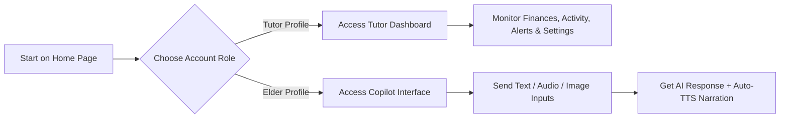

# 📘 FamilIA User Guide

Welcome to the **FamilIA User Guide**. This document walks you through the core flows, typical user journeys, page outlines, and specialized features of the application, emphasizing the **multimodal Copilot assistant** and its newly integrated **Text-to-Speech (TTS)** voice system.

---

## 🧭 Typical User Journey

FamilIA separates the experience into two primary personas: the **Older Adult (Senior)** who seeks financial autonomy, and the **Tutor (Family Member)** who provides a supportive safety net.

### 1. The Welcome & Discovery

Users land on the marketing home page, which breaks down the value proposition in simple, jargon-free terminology:

- **Anti-Fraud Guardrails:** Spotting suspicious banking movements.
- **Friendly Explanations:** Simplifying complex transaction sheets.
- **Family Alerts:** Informing children or tutors when anomalies arise.
- **Empowered Independence:** Enabling the older adult to act autonomously rather than taking their keys away.

### 2. Setting Up Roles (Signup / Signin)

On the onboarding screens, users choose their entry path:

- **Family Tutor:** Manages settings, reviews transaction alerts, adjusts cash tracking metrics, and views history records.
- **Elder Mode:** Designed to be highly accessible and distraction-free. The senior is routed directly to the **Copilot** workspace.

### 3. The Tutor Dashboard

A centralized dashboard for family members to observe without micro-managing. It contains:

- **Overview:** Summary of wallet balances, recent occurrences, and quick security status checks.
- **Activity History:** A chronologically audited timeline of interactions, consultations, and document uploads.
- **Finance Section:** Comprehensive visualization charts comparing bank funds vs. cash estimates, alongside a list of upcoming bills and detected anomalies.
- **Settings:** Lets the tutor adjust passcodes, update the elder's name, set cash baseline thresholds, and manage subscription billing packages.

---

## 🎙️ The Elder Copilot & Voice Synthesis (TTS)

The **Copilot Page** is the heart of the older adult's user experience. It provides a warm, conversational workspace where they can input information dynamically and receive clear guidance.

> [!IMPORTANT]
> **What is the Copilot?**
> The Copilot allows the older adult to type text queries, hold a button to talk (Voice Input), or upload a photo of a document/bill/receipt. The application packages these inputs and securely requests guidance from a remote endpoint.

---

### 🔊 Text-to-Speech (TTS) Accessibility

To ensure high readability and accommodate seniors who may have vision impairments, cataracts, or simply get tired reading screens, FamilIA includes a robust **Text-to-Speech (TTS)** system.

#### How TTS Works

1. **Instant Auto-Play:** When a response is received from the remote assistant, **FamilIA begins reading it aloud automatically** in a clear, localized Spanish voice. The user does not need to click any buttons to start the narration.
2. **Markdown Filtering:** The system automatically sanitizes response text, stripping out markdown notation (such as `*`, `#`, or URL links) so that the synthetic voice does not read symbols aloud.
3. **Interactive Speech Controls:** A set of elegant voice control buttons appear immediately above the response block:

| Control Button        | Icon      | Action                                                        |
| :-------------------- | :-------- | :------------------------------------------------------------ |
| **Escuchar de nuevo** | `Volume2` | Plays the complete voice narration from the beginning.        |
| **Pausar lectura**    | `Pause`   | Temporarily stops the voice playback at the current sentence. |
| **Reanudar lectura**  | `Volume2` | Resumes reading from where the speech was paused.             |
| **Detener**           | `Square`  | Abruptly cancels current narration and hides the Stop button. |

---

## 🛠️ Main Feature Explanations

### 🛡️ Fraud Protection & Anomalies

Tutors receive warning flags when bank statements show double charges, unusual transfers, or off-hour ATM withdrawals. This lets families coordinate directly before small errors turn into bank disputes.

### 📝 Plain-Language Translation

Dense documents and bills are summarized into simplified highlights. Tutors and seniors can upload standard invoices to see a simple explanation of the total cost and what the bill is for.

### 🔒 Elder Profile Settings

Configuration values, such as the elder's custom name (which changes the personalized greetings on the Copilot page) and emergency contact pins, are saved inside browser `localStorage`.

> [!WARNING]
> Since mock data settings are stored in your browser's local state, clearing cookies or cache will restore default values (e.g., reverting the elder's name to _Carmen_).

---

## 🚀 Recommended First Actions for Testing

To evaluate and experience the platform:

1. **Visit the Landing Page:** Review the features and navigate to `/auth/signin`.
2. **Configure Settings:** Go to `/dashboard/settings` and change the Elder's Name (e.g., to _"Sofía"_ or _"Manuel"_).
3. **Navigate to Copilot:** Open the Copilot screen (`/copilot`). Observe the personalized greeting dynamically updating with the new name.
4. **Initiate Copilot Query:** Type a question or upload a mock image, then press **"Preguntar al asistente"**.
5. **Experience TTS:** Listen as the assistant's voice response automatically begins speaking in Spanish. Test the **Pause**, **Resume**, and **Stop** controls to observe state changes.
