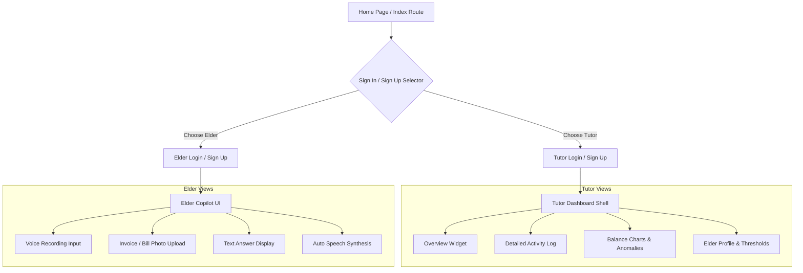

# 📘 FamilIA Comprehensive User Guide

FamilIA is a dedicated, accessibility-focused web application designed to empower older adults to manage their personal finances with confidence while keeping their families (or tutors) informed through a secure, non-intrusive safety net.

This guide provides an exhaustive review of the application's features, typical user journeys, page-by-page guidelines, accessibility design standards, and testing scenarios designed to walk graders and project evaluators through the platform.

---

## 🎨 1. Design & Product Philosophy

Older adults frequently experience barriers when interacting with modern digital banking platforms:

- **Visual Obstacles:** Small text, low contrast, and busy page layouts.
- **Cognitive Load:** Confusing terms like "remittance," "ACH pending," and "pre-authorized draft."
- **Security Anxieties:** Increased vulnerability to sophisticated phishing, social engineering, and financial scams.

FamilIA addresses these problems directly:

- **For Tutors (Family Members):** It acts as an observer's lens. Instead of taking absolute control or lockouts over the senior's funds, the tutor can review aggregate logs, verify recent interactions, adjust alerts, and monitor balances from a clean desktop workspace.
- **For Elders (Seniors):** It provides a welcoming, low-clutter environment dominated by an agentic **Copilot** companion that accepts speech (voice input), images, or simple text, and auto-narrates instructions back using **Text-to-Speech (TTS)**.

---

## 🧭 2. User Roles & Onboarding Flows

FamilIA establishes two distinct user personas, ensuring specialized routes, visual themes, and features for each.



### 👤 The Tutor Account

- **Primary Target:** Sons, daughters, caregivers, or guardians.
- **Layout Design:** Modern, feature-rich desktop-oriented dashboard featuring cards, charts, and table lists.
- **Key Tasks:** Verify unusual charge levels, monitor bank vs. cash ratios, check log histories, and change elder configurations.

### 🧓 The Elder/Senior Account

- **Primary Target:** Older adults seeking straightforward financial advice or fraud checking.
- **Layout Design:** Mobile-first, high-contrast, large-button layout. Features giant icons, personalized greetings, and minimal text entry dependencies.
- **Key Tasks:** Ask conversational questions, upload physical receipts or letters, and listen to vocalized directions.

---

## 📊 3. The Tutor Dashboard In-Depth

The Tutor Dashboard is divided into a base shell layout (`src/routes/dashboard.tsx`) with four functional sub-pages:

### 🏠 A. Overview Page (`/dashboard/index.tsx`)

The central dashboard feed, aggregating indicators for immediate review:

1. **Safety Status Indicator:** Displays a green card labeled `"Todo correcto"` if no critical security anomalies are active, or a prominent warning if a risk is detected.
2. **Elder Wallet Card:** Shows digital balance estimates alongside cash estimates.
3. **Recent Activity Feed:** Summarizes the last 3 logged events (e.g., invoice uploads, voice inquiries) with timestamp values.

### 📜 B. Activity Audit Log (`/dashboard/activity.tsx`)

A chronological record of every interaction the elder has made with the Copilot:

- **Event Classifications:**
  - `INFO`: Standard balance queries or casual questions.
  - `WARNING`: Document uploads, PIN settings modifications.
  - `CRITICAL`: Potential scam detections, suspicious external messages, or invoice warning triggers.
- **Filter System:** Tutors can filter logs by severity level (`Todos`, `Crítico`, `Advertencia`, `Info`) or search using search keywords. This makes auditing past questions easy.

### 📈 C. Finance Monitoring (`/dashboard/finance.tsx`)

A page highlighting banking movement indicators and charts:

1. **Balance Comparison Chart:** An interactive dual-line/bar graph tracking bank account numbers alongside cash holdings over recent months.
2. **Upcoming Charges Log:** Displays predictable recurring charges (e.g., utility bills, streaming services, medicine subscriptions) to help tutors spot duplicate or forgotten accounts.
3. **Detected Anomalies Grid:** Highlights specific weird transactions, such as double charges or unknown company cash drafts, categorizing their risk factor.

### ⚙️ D. Settings Panel (`/dashboard/settings.tsx`)

Controls the client environment properties stored inside the browser:

- **Elder Name Parameter:** Editing this value immediately changes the dynamic greeting texts on the senior's Copilot page.
- **Emergency PIN Entry:** Sets a 4-digit numeric code to protect sensitive configurations.
- **Alert Baseline Sliders:** Customizes budget parameters (e.g., cash baseline estimates, notification thresholds).
- **Billing System:** Provides options to select or upgrade FamilIA service packages (`Básico`, `Premium`, `Familiar`).

---

## 🎙️ 4. The Copilot Experience & Text-to-Speech (TTS)

The Copilot workspace (`src/routes/copilot.tsx`) is designed for maximum ease of use:

### 🎛️ Multimodal Inputs

Seniors can send context using the three large primary buttons at the bottom of the screen:

1. **🎙️ Voice Button (Record):**
   - Designed for users who find mobile keyboards frustrating or painful.
   - Prompts the browser's recording access. Displays a pulsating red recording circle to give clear visual feedback that the microphone is active.
   - Saves the voice query as an audio file blob.
2. **📷 Camera / Photo Button (Upload):**
   - Lets seniors snap or upload images of invoices, official bank letters, or suspicious messages.
   - Displays an progress overlay while uploading.
   - Generates a preview thumbnail so they can verify the image before submission.
3. **⌨️ Text Input Field:**
   - A simplified input box at the bottom center of the page.
   - Features a clean `"Escribe aquí..."` placeholder and a large send button.

---

### 🔊 Text-to-Speech (TTS) Voice Guidance

The Text-to-Speech system reads the AI-generated responses out loud to help seniors digest information easily.

```
+-----------------------------------------------------------+
|               [ Volume Control Bar ]                      |
|                                                           |
|  [Volume2] Escuchar / Reanudar     [Square] Detener/Stop  |
+-----------------------------------------------------------+
|                                                           |
| "Hola Carmen. He analizado la factura de luz que enviaste.|
| No te preocupes, el importe es correcto y se cargará..." |
+-----------------------------------------------------------+
```

#### Key Functional Rules:

- **Instant Auto-Playback:** As soon as the application processes the API response, it triggers the voice synthesis. **The senior does not have to search for or click a start button.**
- **Markdown Stripper:** AI responses contain markdown formatting (such as `**`, `#`, list bullets `-`, or brackets `[]`). Before the speech utterance starts, a regex filter scrubs these formatting symbols. This ensures the voice reads cleanly rather than pronouncing punctuation codes.
- **Voice Customization:** The code targets Spanish (`es-ES`) using the browser's native speech databases.
- **Interactive Player Actions:**
  - **Replay / Resume (`Volume2`):** Starts the reading from the first word, or resumes playback if it was paused.
  - **Pause (`Pause`):** Pauses narration mid-sentence.
  - **Stop (`Square`):** Instantly cancels the speech queue, silencing the browser.

---